# Scriptoria — Documentation Technique

---

## Table des matières

1. [Stack technique & choix technologiques](#1-stack-technique--choix-technologiques)
2. [Architecture générale](#2-architecture-générale)
3. [MCD — Modèle Conceptuel de Données](#3-mcd--modèle-conceptuel-de-données)
4. [MPD — Modèle Physique de Données](#4-mpd--modèle-physique-de-données)
5. [Diagrammes de séquence](#5-diagrammes-de-séquence)
6. [Diagrammes d'activité](#6-diagrammes-dactivité)
7. [Structure des routes Next.js](#7-structure-des-routes-nextjs)
8. [Sécurité — Row Level Security](#8-sécurité--row-level-security)
9. [Système de thèmes](#9-système-de-thèmes)
10. [Composants clés](#10-composants-clés)
11. [Maquettes (wireframes)](#11-maquettes-wireframes)
12. [Variables d'environnement](#12-variables-denvironnement)

---

## 1. Stack technique & choix technologiques

### Frontend

| Technologie | Version | Raison du choix |
|---|---|---|
| **Next.js** | 16.2.4 | App Router avec RSC (React Server Components) — rendu serveur natif, routes API intégrées, pas besoin d'un backend séparé |
| **React** | 19.2.4 | Écosystème riche, hooks, gestion d'état local sans librairie externe |
| **TypeScript** | 5.x | Typage statique, détection d'erreurs à la compilation, meilleure DX |
| **Tailwind CSS** | 4.x | Utilitaire CSS sans configuration lourde, theming via variables CSS natives |
| **Tiptap** | 3.22.x | Éditeur rich-text extensible basé sur ProseMirror, sans vendor lock-in |
| **Lucide React** | 1.8.x | Icônes SVG légères, tree-shakable, cohérentes visuellement |

### Backend & Infrastructure

| Technologie | Version | Raison du choix |
|---|---|---|
| **Supabase** | 2.104.x | BaaS complet : PostgreSQL managé + Auth + Storage + RLS + SDK TypeScript |
| **PostgreSQL** | (via Supabase) | Base relationnelle robuste, support JSONB pour les contenus flexibles (étapes Snowflake), UUID natif |
| **Groq SDK** | 1.1.x | API LLM gratuite (14 400 req/jour), latence faible, modèle llama-3.1-8b suffisant pour la summarisation |
| **next-intl** | 4.9.x | i18n SSR-compatible avec Next.js App Router, 7 langues |

### Pourquoi Supabase plutôt qu'une API custom ?

- **RLS (Row Level Security)** : la sécurité des données est garantie au niveau base de données — même si le code applicatif a un bug, un utilisateur ne peut jamais lire les données d'un autre
- **Auth intégré** : gestion des sessions, tokens, refresh automatique
- **Storage** : upload de fichiers avec policies identiques au RLS
- **Realtime** (futur) : WebSockets natifs pour collaboration en temps réel

### Pourquoi Groq plutôt qu'OpenAI/Anthropic ?

- **Gratuit** pour les usages modérés (14 400 req/jour)
- **Latence sub-seconde** grâce aux puces LPU Groq
- **Compatible** avec le format OpenAI (migration facile si besoin)
- **Pas de coût** pour les utilisateurs de la plateforme

---

## 2. Architecture générale

```
┌─────────────────────────────────────────────────────┐
│                   NAVIGATEUR                         │
│  ┌──────────────┐    ┌──────────────────────────┐   │
│  │ React Client │    │  Server Components (RSC) │   │
│  │ Components   │    │  app/(dashboard)/**      │   │
│  │ 'use client' │    │  Fetch DB au build/req   │   │
│  └──────┬───────┘    └───────────┬──────────────┘   │
└─────────┼───────────────────────┼──────────────────┘
          │ fetch                  │ supabase-js/server
          ▼                        ▼
┌─────────────────────────────────────────────────────┐
│                  NEXT.JS SERVER                      │
│  ┌────────────────┐   ┌────────────────────────┐    │
│  │  /api/ai       │   │  /api/auth/callback    │    │
│  │  Route Handler │   │  Route Handler         │    │
│  │  (Groq stream) │   │  (OAuth exchange)      │    │
│  └───────┬────────┘   └──────────┬─────────────┘    │
└──────────┼──────────────────────┼──────────────────┘
           │                       │
           ▼                       ▼
    ┌──────────────┐     ┌──────────────────────┐
    │  GROQ API    │     │  SUPABASE             │
    │  llama-3.1-8b│     │  ┌─────────────────┐ │
    └──────────────┘     │  │  PostgreSQL DB   │ │
                         │  │  + RLS policies  │ │
                         │  ├─────────────────┤ │
                         │  │  Auth Service    │ │
                         │  ├─────────────────┤ │
                         │  │  Storage (S3)   │ │
                         │  │  media/ bucket  │ │
                         │  └─────────────────┘ │
                         └──────────────────────┘
```

---

## 3. MCD — Modèle Conceptuel de Données

Le MCD représente les entités métier et leurs associations indépendamment de l'implémentation.

```
┌──────────────┐         ┌───────────────────┐
│    USER      │         │     PROJECT        │
│──────────────│  crée   │───────────────────│
│ id           │─────────│ id                │
│ email        │ 1    0..n│ title             │
│ password     │         │ genre             │
└──────────────┘         │ project_type      │
        │                │ cover_url         │
        │                └─────────┬─────────┘
        │                          │
        │ possède                  │ contient
        │                    ┌─────┴──────┐
        │                    │            │
        │             ┌──────┴──────┐  ┌──┴──────────────┐
        │             │ SNOWFLAKE   │  │    CHAPTER       │
        │             │   STEP      │  │────────────────  │
        │             │─────────────│  │ id               │
        │             │ step_number │  │ title            │
        │             │ content     │  │ description      │
        │             │ (jsonb)     │  │ position         │
        │             └─────────────┘  └────────┬─────────┘
        │                                        │ contient
        │                               ┌────────┴──────────┐
        │                               │     DOCUMENT       │
        │                               │────────────────────│
        │                               │ id                 │
        │                               │ name               │
        │                               │ storage_path       │
        │                               │ mime_type          │
        │                               │ size_bytes         │
        │                               └────────────────────┘
        │
        │ crée
        ▼
┌──────────────┐
│    PERSON    │
│──────────────│
│ id           │
│ name         │
│ bio          │
│ avatar_url   │
└──────┬───────┘
       │
       ├──────────────────────────────────────────┐
       │                                           │
       │ participe à (project_member)              │ est lié à
       │                                           │ (character_link)
       ▼                                           ▼
┌────────────────────┐              ┌───────────────────────┐
│  PROJECT_MEMBER    │              │   CHARACTER_LINK       │
│────────────────────│              │───────────────────────│
│ role               │              │ relationship (label)   │
│ position           │              │                       │
└────────────────────┘              └───────────────────────┘

┌──────────────┐
│   LOCATION   │
│──────────────│
│ id           │
│ name         │
│ description  │
└──────┬───────┘
       │ possède
       ▼
┌──────────────────┐
│ LOCATION_PHOTO   │
│──────────────────│
│ id               │
│ storage_path     │
│ name             │
└──────────────────┘

┌──────────────┐
│  SAVED_ROLE  │
│──────────────│
│ id           │
│ role         │
└──────────────┘
```

### Cardinalités

| Association | Entité A | Cardinalité | Entité B |
|---|---|---|---|
| crée | USER | 1,1 — 0,N | PROJECT |
| contient | PROJECT | 1,1 — 0,N | SNOWFLAKE_STEP |
| contient | PROJECT | 1,1 — 0,N | CHAPTER |
| contient | CHAPTER | 1,1 — 0,N | DOCUMENT |
| possède | USER | 1,1 — 0,N | PERSON |
| participe | PERSON | 0,N — 0,N | PROJECT (via PROJECT_MEMBER) |
| est lié | PERSON | 0,N — 0,N | PERSON (via CHARACTER_LINK) |
| possède | USER | 1,1 — 0,N | LOCATION |
| illustre | LOCATION | 1,1 — 0,N | LOCATION_PHOTO |
| sauvegarde | USER | 1,1 — 0,N | SAVED_ROLE |

---

## 4. MPD — Modèle Physique de Données

Le MPD correspond aux tables PostgreSQL réellement créées dans Supabase.

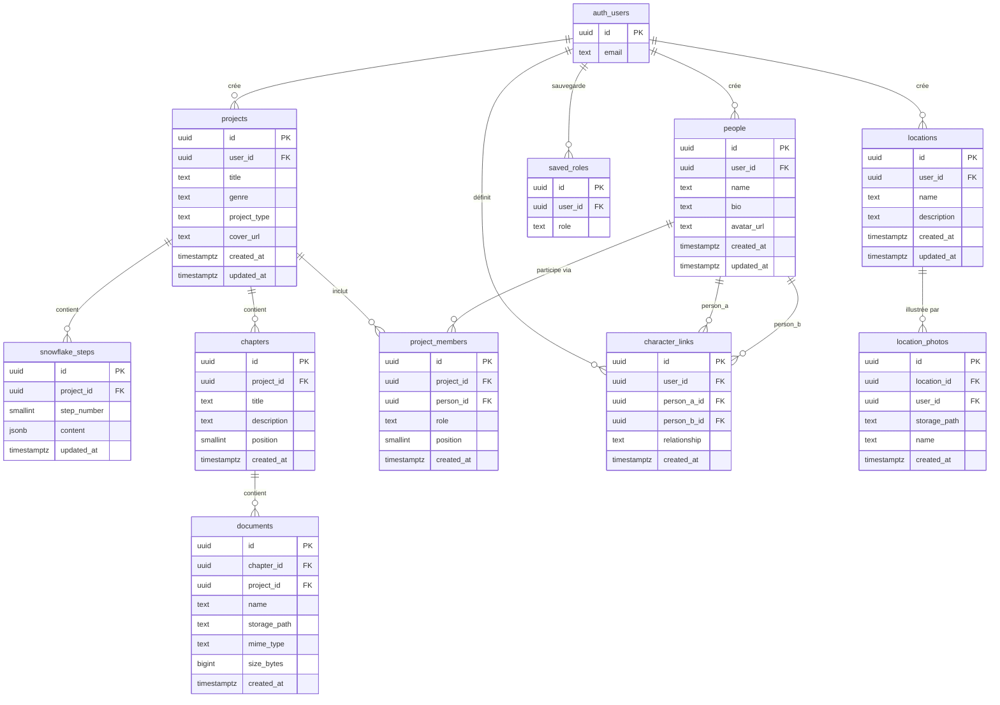

### Index et contraintes notables

| Table | Contrainte | Type |
|---|---|---|
| snowflake_steps | UNIQUE(project_id, step_number) | Unicité |
| project_members | UNIQUE(project_id, person_id) | Unicité |
| character_links | UNIQUE(person_a_id, person_b_id) | Unicité symétrique |
| saved_roles | UNIQUE(user_id, role) | Unicité |
| projects | INDEX(user_id) | Performance |
| people | INDEX(user_id) | Performance |
| character_links | INDEX(person_a_id), INDEX(person_b_id) | Performance |

### Champ JSONB — snowflake_steps.content

Le contenu de chaque étape est stocké en JSONB pour permettre des structures différentes par étape :

```json
// Étape 1
{ "premise": "Un détective découvre que..." }

// Étape 2
{
  "setup": "...",
  "conflict1": "...",
  "conflict2": "...",
  "conflict3": "...",
  "resolution": "..."
}

// Étape 3 (roman)
{
  "protagonist_name": "Alice",
  "protagonist_goal": "...",
  "protagonist_conflict": "...",
  "protagonist_arc": "...",
  "antagonist_name": "Victor",
  "antagonist_motivation": "..."
}

// Étape 4
{ "synopsis": "..." }
```

---

## 5. Diagrammes de séquence

### 5.1 Authentification

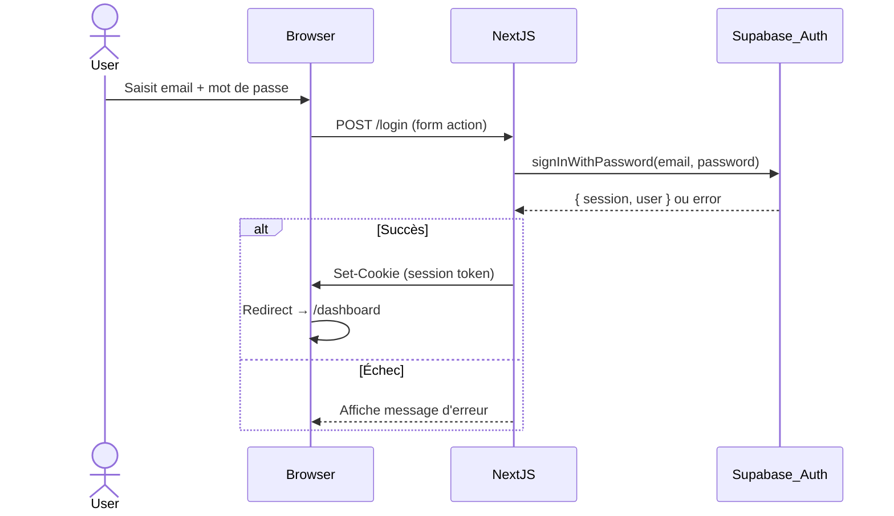

---

### 5.2 Création d'un projet

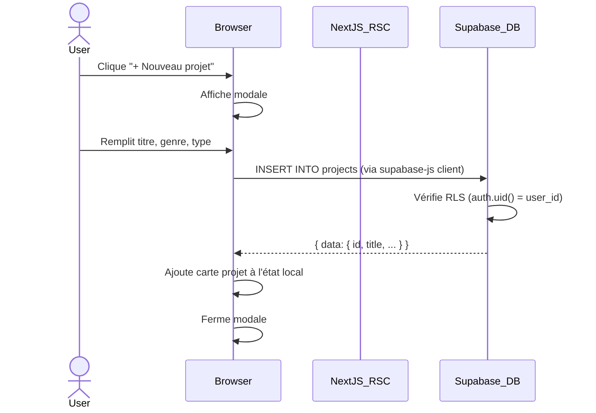

---

### 5.3 Upload d'un avatar personnage

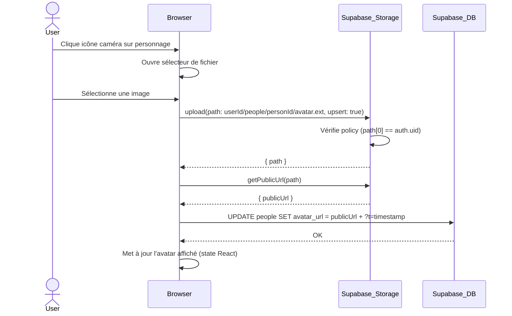

---

### 5.4 Appel à l'assistant IA (streaming)

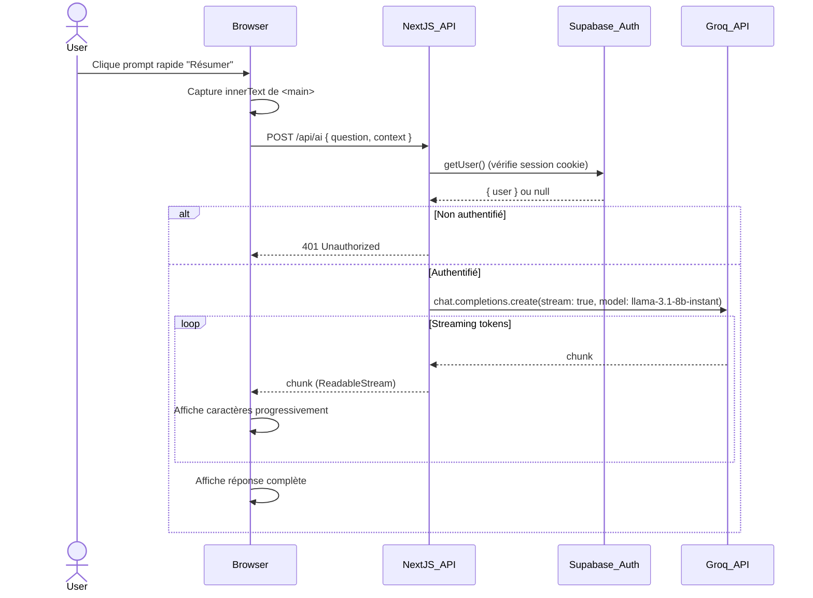

---

### 5.5 Sauvegarde d'une étape Snowflake

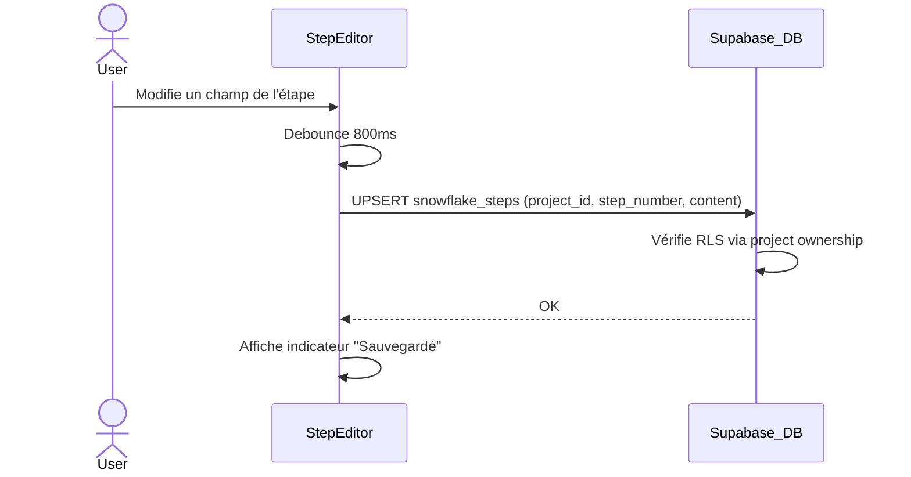

---

### 5.6 Lien entre personnages

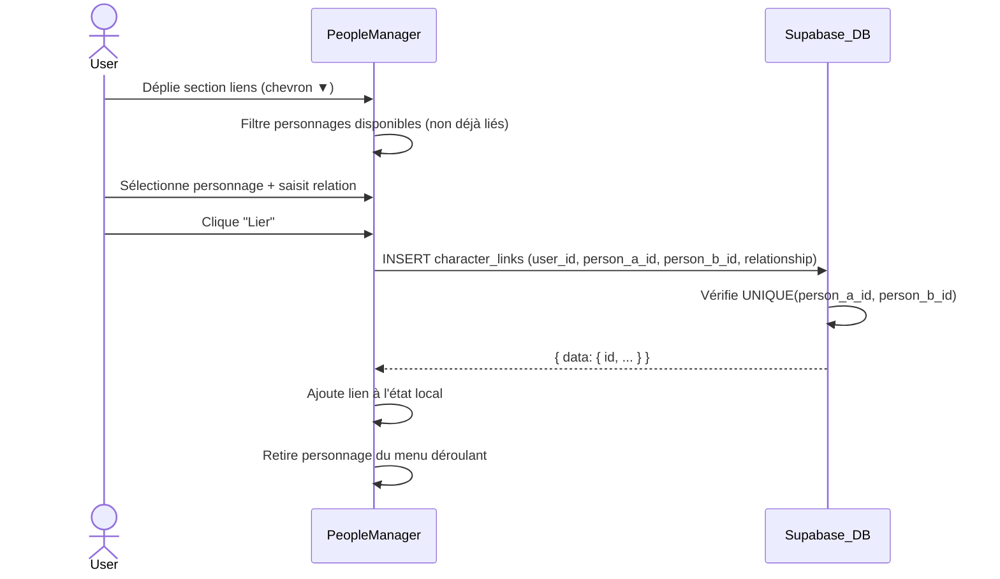

---

## 6. Diagrammes d'activité

### 6.1 Flux de création d'un roman complet

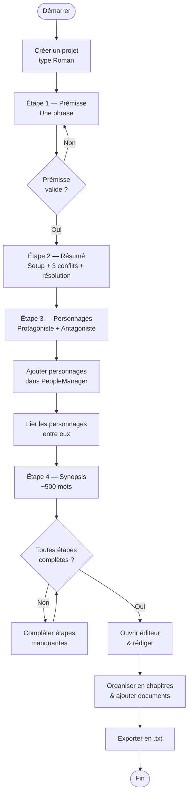

---

### 6.2 Gestion d'un personnage

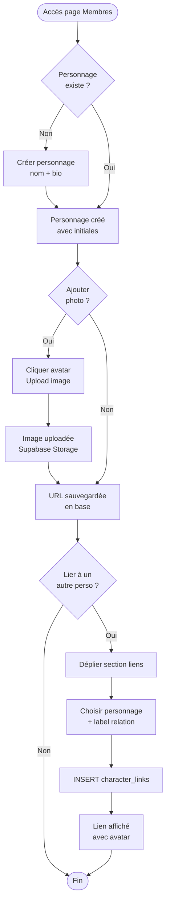

---

### 6.3 Authentification et accès protégé

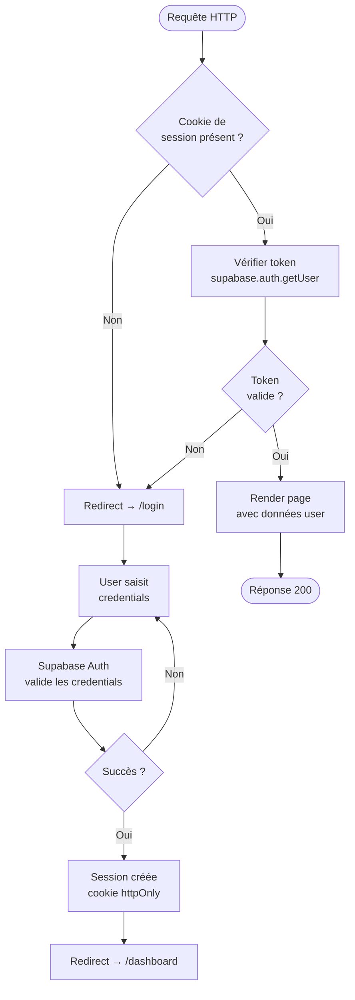

---

### 6.4 Upload et affichage d'une couverture

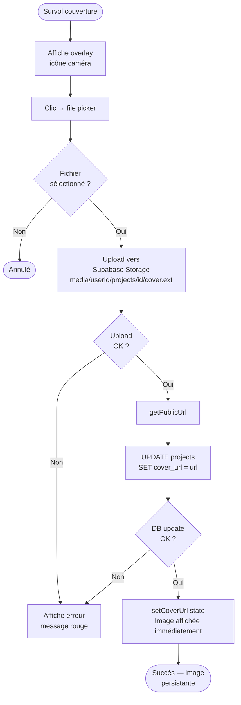

---

## 7. Structure des routes Next.js

```
app/
├── page.tsx                          # Landing (public)
│
├── (auth)/                           # Groupe sans layout dashboard
│   ├── login/page.tsx                # Formulaire login
│   └── register/page.tsx             # Formulaire inscription
│
├── (dashboard)/
│   ├── layout.tsx                    # Guard auth + Navbar + AiAssistant
│   │
│   ├── dashboard/page.tsx            # Liste des projets
│   ├── people/page.tsx               # Personnages + Lieux
│   │
│   └── project/[id]/
│       ├── page.tsx                  # Vue projet (roue + couverture + étapes)
│       ├── steps/page.tsx            # Liste des 4 étapes
│       ├── step/[step]/page.tsx      # Éditeur d'une étape (1-4)
│       ├── write/page.tsx            # Éditeur Tiptap
│       ├── documents/page.tsx        # Chapitres
│       └── documents/[chapterId]/page.tsx  # Documents d'un chapitre
│
└── api/
    ├── ai/route.ts                   # POST /api/ai (Groq streaming)
    └── auth/callback/route.ts        # GET /api/auth/callback (OAuth)
```

### Pattern Server vs Client Components

| Composant | Type | Raison |
|---|---|---|
| `page.tsx` (tous) | Server Component | Fetch DB sécurisé côté serveur, SEO |
| `layout.tsx` dashboard | Server Component | Vérification auth avant render |
| `PeopleManager` | Client (`'use client'`) | Interactions, état local, upload |
| `PersonaWheel` | Client | SVG interactif, hover states |
| `ProjectSidebar` | Client | Gestion du panneau slide-in |
| `BookCover` | Client | Upload fichier, état local |
| `WritingEditor` | Client | Tiptap nécessite le DOM |
| `AiAssistant` | Client | Streaming SSE, état chat |
| `ThemeProvider` | Client | localStorage, `document` |

---

## 8. Sécurité — Row Level Security

Toutes les tables ont RLS activé. Le principe : **chaque utilisateur n'accède qu'à ses propres données**.

### Politique type (projects)

```sql
-- SELECT
CREATE POLICY "Users can view own projects"
ON projects FOR SELECT
USING (auth.uid() = user_id);

-- INSERT
CREATE POLICY "Users can insert own projects"
ON projects FOR INSERT
WITH CHECK (auth.uid() = user_id);

-- UPDATE / DELETE : idem avec USING
```

### Accès indirect (snowflake_steps, chapters, documents)

Pour les tables liées à `projects`, l'accès est vérifié via une sous-requête :

```sql
CREATE POLICY "Users can access own project steps"
ON snowflake_steps FOR SELECT
USING (
  EXISTS (
    SELECT 1 FROM projects
    WHERE projects.id = snowflake_steps.project_id
    AND projects.user_id = auth.uid()
  )
);
```

### Storage RLS (bucket `media`)

```sql
-- Upload : le premier segment du chemin doit être l'uid
CREATE POLICY "Users can upload own media"
ON storage.objects FOR INSERT
WITH CHECK (
  bucket_id = 'media'
  AND (string_to_array(name, '/'))[1] = auth.uid()::text
);
```

Les chemins de stockage suivent le pattern :
- `{uid}/people/{personId}/avatar.ext`
- `{uid}/projects/{projectId}/cover.ext`
- `{uid}/locations/{locationId}/{timestamp}_{slug}.ext`

---

## 9. Système de thèmes

### Variables CSS

```css
/* Dark (défaut) */
:root, [data-theme="dark"] {
  --bg-base:    #0c0a09;
  --bg-card:    #1c1917;
  --bg-input:   #292524;
  --border:     #44403c;
  --text-primary:   #f5f5f4;
  --text-secondary: #d6d3d1;
  --text-muted:     #a8a29e;
  --accent:     #f59e0b;
}

/* Light */
[data-theme="light"] {
  --bg-base:    #f1f5f9;
  --bg-card:    #ffffff;
  --bg-input:   #ffffff;
  --border:     #cbd5e1;
  --text-primary:   #0f172a;
  --text-secondary: #334155;
  --text-muted:     #64748b;
}

/* Retro */
[data-theme="retro"] {
  --bg-base:    #f4ede0;
  --bg-card:    #fefbf3;
  --bg-input:   #fefbf3;
  --border:     #c9b99a;
  --text-primary:   #2d1a0e;
  --text-secondary: #4a2f15;
  --text-muted:     #7a5c38;
}
```

### Fonctionnement

1. `ThemeProvider` lit `localStorage.getItem('theme')` au montage
2. Applique `document.documentElement.setAttribute('data-theme', theme)`
3. Tous les composants utilisent `var(--bg-card)` etc. → jamais de couleur hardcodée Tailwind

### Inputs globaux (globals.css)

```css
input:not([type="checkbox"]):not([type="radio"]):not([type="range"]),
textarea, select {
  background-color: var(--bg-input);
  color: var(--text-primary);
  border-color: var(--border);
}
```

---

## 10. Composants clés

### PersonaWheel

- SVG pur, viewBox 480×480
- Centre : cercle teal avec initiales du titre de projet
- Nœuds : positionnés en cercle (rayon 158px) par calcul trigonométrique
- Couleurs : amber (protagonist), red (antagonist), violet (secondary), teal (team)
- Hover : glow + changement couleur ligne + label en cyan
- Clic → callback `onNodeClick()` → ouvre `ProjectSidebar`

```
CX=240, CY=240, CENTER_R=50, NODE_R=34, ORBIT_R=158

angle = (i / total) * 2π - π/2
x = CX + ORBIT_R * cos(angle)
y = CY + ORBIT_R * sin(angle)
```

### AiAssistant (streaming)

```typescript
// Côté client : lecture du stream
const reader = response.body.getReader()
const decoder = new TextDecoder()
while (true) {
  const { done, value } = await reader.read()
  if (done) break
  setAnswer(prev => prev + decoder.decode(value))
}
```

```typescript
// Côté serveur : création du stream Groq
const stream = await groq.chat.completions.create({
  messages: [...],
  model: 'llama-3.1-8b-instant',
  stream: true,
  max_tokens: 512,
})
const readable = new ReadableStream({
  async start(controller) {
    for await (const chunk of stream) {
      const text = chunk.choices[0]?.delta?.content ?? ''
      controller.enqueue(new TextEncoder().encode(text))
    }
    controller.close()
  }
})
return new Response(readable, { headers: { 'Content-Type': 'text/plain' } })
```

---

## 11. Maquettes (wireframes)

> Les maquettes suivantes décrivent la structure visuelle de chaque écran principal. Pour les implémenter dans Figma, utiliser les variables de couleur définies en section 9 et le composant BookCover comme référence pour le ratio 2:3.

---

### Écran 1 — Tableau de bord

```
┌─────────────────────────────────────────────────────────────┐
│  NAVBAR  [Logo Scriptoria]    [Membres] [✨ AI] [Thème] [User] │
├─────────────────────────────────────────────────────────────┤
│                                                             │
│  Mes projets                            [+ Nouveau projet]  │
│                                                             │
│  ┌─────────────┐  ┌─────────────┐  ┌─────────────┐        │
│  │ 📖 Roman    │  │ 👥 Équipe   │  │ 📖 Roman    │        │
│  │             │  │             │  │             │        │
│  │ Titre       │  │ Titre       │  │ Titre       │        │
│  │ Genre       │  │ Genre       │  │ Genre       │        │
│  │             │  │             │  │             │        │
│  │ Créé le ... │  │ Créé le ... │  │ Créé le ... │        │
│  └─────────────┘  └─────────────┘  └─────────────┘        │
│                                                             │
└─────────────────────────────────────────────────────────────┘
```

---

### Écran 2 — Page projet (vue d'ensemble)

```
┌─────────────────────────────────────────────────────────────┐
│  NAVBAR                                                      │
├─────────────────────────────────────────────────────────────┤
│                                                              │
│  Colonne gauche (50%)          │  Colonne droite (50%)       │
│                                │                             │
│  Mes projets › Titre           │  ┌───────────────────────┐  │
│  [ Titre du projet ]   [Écrire]│  │   PERSONA WHEEL       │  │
│  Genre                         │  │                       │  │
│                                │  │    ●   ●              │  │
│  ██████████████░░░ 75%         │  │  ●  [Titre]  ●        │  │
│  Snowflake                     │  │    ●   ●              │  │
│                                │  │                       │  │
│  ┌──────────────────────────┐  │  │  "Cliquez pour gérer" │  │
│  │ ✅ Étape 1 — Prémisse    │  │  └───────────────────────┘  │
│  └──────────────────────────┘  │                             │
│  ┌──────────────────────────┐  │  ┌───────────────────────┐  │
│  │ ✅ Étape 2 — Résumé      │  │  │ 📖  COUVERTURE        │  │
│  └──────────────────────────┘  │  │ ┌──┬────────────────┐ │  │
│  ┌──────────────────────────┐  │  │ │▐▌│  [image]       │ │  │
│  │ ○  Étape 3 — Personnages │  │  │ │▐▌│  Genre         │ │  │
│  └──────────────────────────┘  │  │ │▐▌│  Titre         │ │  │
│  ┌──────────────────────────┐  │  │ └──┴────────────────┘ │  │
│  │ ○  Étape 4 — Synopsis    │  │  └───────────────────────┘  │
│  └──────────────────────────┘  │                             │
│                                │                             │
│  ┌──────────────────────────┐  │                             │
│  │ 📁 Documents             │  │                             │
│  └──────────────────────────┘  │                             │
│                                                              │
└──────────────────────────────────────────────────────────────┘
```

---

### Écran 3 — Panneau personnages (slide-in)

```
┌──────────────────────────────────────────────┬──────────────────────────┐
│  [arrière-plan flou de la page]              │  Personnages          [×] │
│                                              │──────────────────────────│
│                                              │  Créez et gérez vos      │
│                                              │  personnages             │
│                                              │                          │
│                                              │  ┌──────────────────┐    │
│                                              │  │ 👤 Alice Martin  │ [▼]│
│                                              │  │ Détective, 40 ans│    │
│                                              │  └──────────────────┘    │
│                                              │                          │
│                                              │  ┌──────────────────┐    │
│                                              │  │ 👤 Victor Dumont │ [▼]│
│                                              │  └──────────────────┘    │
│                                              │                          │
│                                              │  [+ Ajouter un perso]    │
└──────────────────────────────────────────────┴──────────────────────────┘
```

---

### Écran 4 — Page Membres (Personnages & Lieux)

```
┌─────────────────────────────────────────────────────────────┐
│  NAVBAR                                                      │
├─────────────────────────────────────────────────────────────┤
│                                                              │
│  Personnages                                                 │
│  Créez vos personnages, ajoutez une photo                    │
│                                                              │
│  ┌────────────────────────────────────────────────────────┐ │
│  │ [📷] Alice Martin      Détective cynique, 40 ans  [▼][🗑]│ │
│  └────────────────────────────────────────────────────────┘ │
│  ┌────────────────────────────────────────────────────────┐ │
│  │ [VM] Victor Dumont     Antagoniste principal     [▼][🗑]│ │
│  └────────────────────────────────────────────────────────┘ │
│                                                              │
│  ┌── Liens de Victor ─────────────────────────────────────┐ │
│  │  [📷] Alice Martin — rival                          [×]│ │
│  │  ─────────────────────────────────────────────────────│ │
│  │  Relier à : [choisir…▼] [relation…____] [+ Lier]      │ │
│  └────────────────────────────────────────────────────────┘ │
│                                                              │
│  [+ Ajouter un personnage]                                   │
│  ────────────────────────────────                            │
│                                                              │
│  Lieux                                                       │
│                                                              │
│  ┌──────────────┐  ┌──────────────┐                         │
│  │ [photo]      │  │ [photo]      │                         │
│  │ Brocéliande  │  │ Paris 1900   │                         │
│  │ 3 photos [▼] │  │ 1 photo  [▼] │                         │
│  └──────────────┘  └──────────────┘                         │
│                                                              │
│  [+ Ajouter un lieu]                                        │
└─────────────────────────────────────────────────────────────┘
```

---

### Écran 5 — Éditeur Snowflake (Étape 2)

```
┌─────────────────────────────────────────────────────────────┐
│  NAVBAR                                                      │
├─────────────────────────────────────────────────────────────┤
│                                                              │
│  ← Titre du projet   Étape 2 — Le Résumé                    │
│                                                              │
│  Setup (situation initiale)                                  │
│  ┌──────────────────────────────────────────────────────┐   │
│  │ Alice Martin, 40 ans, détective désabusée…           │   │
│  └──────────────────────────────────────────────────────┘   │
│                                                              │
│  Premier conflit                                             │
│  ┌──────────────────────────────────────────────────────┐   │
│  │                                                      │   │
│  └──────────────────────────────────────────────────────┘   │
│                                                              │
│  [ Deuxième conflit ] [ Troisième conflit ] [ Résolution ]  │
│                                                              │
│                                      ✓ Sauvegardé           │
│                                                              │
└─────────────────────────────────────────────────────────────┘
```

---

### Écran 6 — Éditeur d'écriture

```
┌─────────────────────────────────────────────────────────────┐
│  [← Retour]  Titre du document ___________  [Enregistrer]  │
├─────────────────────────────────────────────────────────────┤
│  [G] [I] [S] [↩] [↪]                                       │
│─────────────────────────────────────────────────────────────│
│                                                              │
│                                                              │
│     Il était une fois dans les rues brumeuses de Paris…     │
│     |  (curseur)                                            │
│                                                              │
│                                                              │
│                                                              │
│                                                              │
├─────────────────────────────────────────────────────────────┤
│  342 mots                                                   │
└─────────────────────────────────────────────────────────────┘
                                              [✨] ← AI bouton
```

---

## 12. Variables d'environnement

Fichier `.env.local` requis :

```env
# Supabase
NEXT_PUBLIC_SUPABASE_URL=https://xxxx.supabase.co
NEXT_PUBLIC_SUPABASE_ANON_KEY=eyJhb...

# Groq (serveur uniquement — ne pas préfixer NEXT_PUBLIC_)
GROQ_API_KEY=gsk_...
```

### Obtenir les clés

| Variable | Où la trouver |
|---|---|
| `NEXT_PUBLIC_SUPABASE_URL` | Supabase Dashboard → Settings → API |
| `NEXT_PUBLIC_SUPABASE_ANON_KEY` | Supabase Dashboard → Settings → API |
| `GROQ_API_KEY` | console.groq.com → API Keys |

---

*Documentation générée en avril 2026 — Version 0.1.0*
